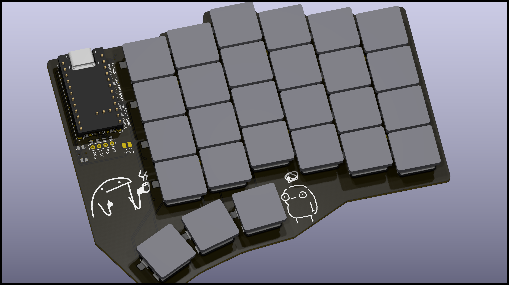
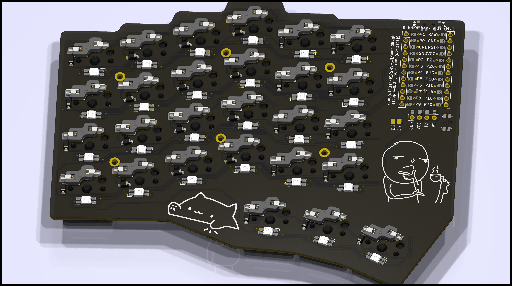
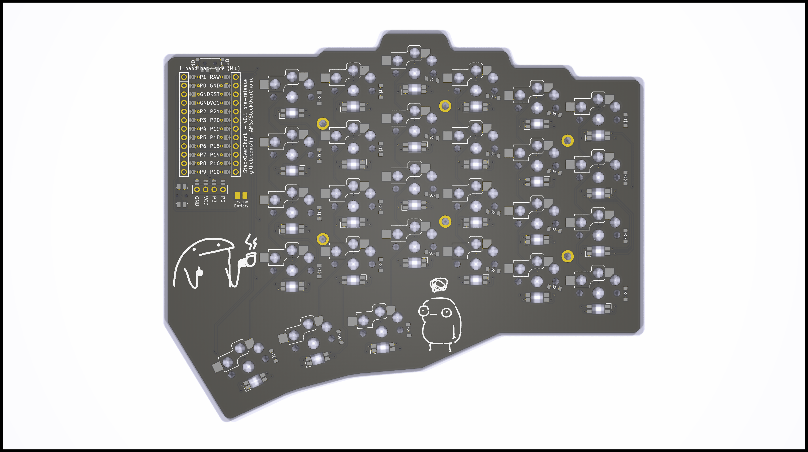

# References

- [custom ergogen-footprints](https://github.com/ceoloide/ergogen-footprints)
- [3d models to view in kicad](https://github.com/joe-scotto/scottokeebs/tree/main/Extras/ScottoKicad)
- [josukey](https://github.com/Narkoleptika/josukey)
- [avocado](https://github.com/auryn31/avocado)
- [supermini pinout specs](https://docs.nordicsemi.com/bundle/ps_nrf52840/page/pin.html)
- [Arduino Pro Micro Pinout](https://cdn.sparkfun.com/assets/9/c/3/c/4/523a1765757b7f5c6e8b4567.png)
- [ergogen configs from Corney-island](https://github.com/ceoloide/corney-island/blob/main/ergogen/config.yaml)
- [svg to points](https://shinao.github.io/PathToPoints/)

# Renders

# Personal Notes and Todos
For RGB Underglow, ZMK docs recomments using high speed gpio pins. refer to the attached pinout specs above.

Try to reserve pins like so (pins in arduino format)
- D2 & D3 for I2C - for Displays
- D6 for high speed comms like RGB underglow, because docs is also using it
- D14, D15, D16 - SPI - idk what i might use this for, just leave em blank

can the battery be connected to RAW for charging or do i have to connect it to top two pins

